  

  

  <em>Breaking & building things the safe way — one local VM at a time.</em>

---

## 🛡️ Featured Projects

| Project | Description | Tech |
|---------|-------------|------|
| [**UsaHack**](https://github.com/oussamasaidguerni-cyber/usahack) | Deliberately vulnerable Flask web app to practice the OWASP Top 10. Runs locally, fully self-contained. | 🐍 Python · Flask |
| [**Logwatch**](https://github.com/oussamasaidguerni-cyber/logwatch) | SOC log anomaly detector: SSH brute force, SQLi, path traversal, scanner detection + Flask dashboard | 🐍 Python · Flask |

---

## 🧰 Toolbox

  
  
  
  
  

---

## 📊 The Numbers

  
  

  

---

<!-- 🐍 Contribution Snake — enabled once workflow scope is granted

  <picture>
    <source media="(prefers-color-scheme: dark)" srcset="https://raw.githubusercontent.com/oussamasaidguerni-cyber/oussamasaidguerni-cyber/output/github-contribution-grid-snake-dark.svg" />
    
  </picture>

*Eats my contributions every night. Purple fuel. 🟣*
-->

---

## 💡 Learning Roadmap

- [x] OWASP Top 10 basics
- [x] SQL Injection & XSS
- [ ] Network / SOC analysis
- [ ] CTF challenges
- [ ] Bug bounty hunting

---

  
   
  <strong>⚛️ motivated</strong>

